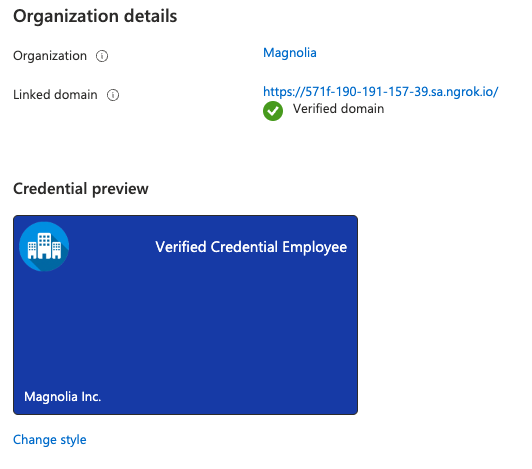

# Workshop Microsoft Verifiable Credentials for Keycloak Identity Claims (SSI)
This repository demonstrates how to integrate [Microsoft Entra Verified ID](https://www.microsoft.com/en-us/security/business/identity-access/microsoft-entra-verified-id) with your Identity Provider for issuing [Verifiable Credentials](https://www.w3.org/TR/vc-data-model/) based on identity tokens.  
In the workshop I have explained how to integrate with [Auth0](https://auth0.com/) or
[Keycloak](https://www.keycloak.org/) for issuing VCs. Nevertheless, you can also integrate it with other Identity Providers.
## In Short
This workshop is based on the concept of [Decentralized Identity](https://identity.foundation/) (also known as Verifiable Credentials) which leads to the idea that identity-related information should be self-controlled, portable and with decentralized identifiers. In short, self-sovereign identity (SSI) or [decentralized identity](https://www.w3.org/TR/did-core/) (DID) is a method of identity that centers the control of information around the user.
VCs are tamper-proof, cryptographically-verifiable claims made by the issuer. Every attestation that an entity (e.g., an organization) issues is associated with their DID.

The following architecture diagram describes the workshop components involved in the verifiable credentials ecosystem.

 

The followin gives an overview of how VC works - An article will be released soon with more details, theoretical and technical background about verifiable credentials.

### Workshop Scenario:
- Magnolia Inc. (issuer) issues Employee credential (verifiable credentials) for your Employees. The employees are being authenticated with the Enterprise Identity Provider which is integrated with the Magnolia Employee portal. This portal is capable of issuing Employee Verifiable credentials.
- The employees (holder) use Microsoft Authenticator as the company’s Identity wallet for handling the authentication and verified IDs use cases.
- Orion Global Inc. is a telecommunication company that trusts in the Employee verifiable credentials issued by Magnolia Inc. as proof of Employment. The Telco Portal can validate Magnolia Employee verifiable credentials.
- The goal is, thanks to the decentralized credentials, that Magnolia employees be capable of providing a proof of Employment to Orion Global to access the portal. On the other hand, Orion is capable of verifying the employee’s authenticity, improving the user experience (KYC) in the customer onboarding and sign in processes and improving the security avoiding Identity fraud.

### Workshop Technical Background Overview

- Magnolia Inc has configured its tenant configuration for issuing verifiable credentials in Microsoft Entra Verified ID. It also has configured the Azure ID Vault for signing credentials.
- [Magnolia Employee portal](./vc-issuer-app-spring) is a Spring Boot application integrated with OpenID Connect with an Identity Provider. It’s also integrated with Microsoft Entra Verified Services for issuing VCs. It has configured Spring Security OAuth 2.0 for the OpenID Connect integration with IdP and Client Credentials grant with Azure AD.
- After the employee is authenticated, the verifiable credential is configured to use the Identity token claims from the IdP. The employee credential is signed by Magnolia and includes the employees DID as the subject DID. 
- [Telco Portal](./vc-verifier-app-spring) is integrated with Microsoft Entra Verified Services for verifying VC on the onboarding and sign-in process. Furthermore, it has configured Spring Security OAuth 2.0 Client Credentials grant with Azure AD.
- Identity Provider manages the identities and exposes the OpenID Connect endpoints for handling the authentication with Magnolia Employee Portal and Microsoft Authenticator (Digital wallet).
- Microsoft Entra Verified ID exposes the verification services for verifiable credentials use cases. Because DIDs are stored on the blockchain, anyone can verify the validity of an attestation by cross-checking the issuer's DID.

# How to deploy?

## Prerequisites
- Azure tenant with an active subscription
- Install Git, Docker in order to run the steps provided in the next section
- A mobile device with Microsoft Authenticator
- [ngrok](https://ngrok.com/) and sign up for a free account

## Getting Started

1. Obtaining your ngrok public url  
   Several endpoints must be published to the Internet. In this case to simplify the workshop, I have used ngrok for exposing those services.

   ```sh
   docker run -it -e NGROK_AUTHTOKEN={your-ngrok-token} ngrok/ngrok:alpine http 80

   Session Status               online                                                                                                    ...
   Forwarding                   https://f27c-190-191-157-39.sa.ngrok.io -> http://localhost     
   ```

   You will use this public url for exposing the services to the Internet through an nginx container provided in the workshop, e.g.: ```DOMAIN_URL: https://6ff7-190-191-157-39.sa.ngrok.io```
 
2. Clone this repository
 
   ```bash
   git clone https://github.com/twogenidentity/microsoft-verifiable-credentials-workshop
   cd microsoft-verifiable-credentials-workshop
   ```
  
### Microsoft Azure and Entra Configuration Steps

3. Configure your tenant for Microsoft Entra Verified ID
  * Create an [Azure Key Vault instance](https://learn.microsoft.com/en-us/azure/active-directory/verifiable-credentials/verifiable-credentials-configure-tenant#create-a-key-vault)
  * Set up the Verified ID service with the public url obtained from STEP 1
    ```
    e.g:
    Organization name: Magnolia
    Trusted domain: {your-public-url}
    Key vault: {your-kv-vault}
    ```
  * Register an application in Azure AD

4. Configure Service endpoint configuration

  * Copy or download the DID document to the did.json and did-configuration.json file in the folder microsoft-verifiable-credentials-workshop
  * Add the value of the DOMAIN_URL to the ```.env``` file
  * Run the following commands to expose those did json files. (e.g: https://domain/.well-known/did.json and  https://domain/.well-known/did-configuration.json) with the nginx container

    ```sh
    docker run -it --rm --name lb-did -p 80:80 \
    -v $(pwd)/nginx/base.conf:/etc/nginx/conf.d/default.conf \
    -v $(pwd)/nginx/did-location.conf:/etc/nginx/includes/did-location.conf \
    -v $(pwd)/did.json:/usr/share/nginx/html/did.json \
    -v $(pwd)/did-configuration.json:/usr/share/nginx/html/did-configuration.json nginx:alpine
    ```

 * Proceed to complete the verification steps in Microsoft Entra

5. Create the verifiable credential ```VerifiableCredentialEmployee``` for the workshop:

  * Credentials > Select “Custom Credential”
  * Credential Name: ```VerifiedCredentialEmployee```
  * Copy and paste the content of the file ```presentation-employee-display.json``` to Display definition text box 
  * Then based on your Identity Provider integration:
    *  For Auth0: Copy and paste the ```presentation-employee-rules-auth0.json``` to Rules definition text box and replace in the Rules Definition textbox the value ```{AUTH0_DOMAIN}``` with your Auth0 Tenant
    * For Keycloak: Copy and paste the ```presentation-employee-rules.json``` to Rules definition text box and replace in the Rules Definition textbox the value ```{DOMAIN_URL}``` with your public domain url  
  * Click “Create”

     
 Once you finish those steps stop the docker container ( <kbd>Ctrl</kbd>+<kbd>C</kbd>)

## Configure and deploy the workshop

1. Adjust the ```.env``` file with your configuration.

| Component                 |  From                         |  To                   | 
|:-------------------------:|:------------------------------|:----------------------|
| ngrok                     |   Public URI                  |  ```.env``` > ```DOMAIN_URL```    |
| MS Entra Verified ID      |   Org Settings > Decentralized identifier (DID)                      |  ```.env``` > ```VC_AUTHORITY```    |
| MS Entra Verified ID      |   Credentials > VerifiedCredentialEmployee > Manifest URL                      |  ```.env``` > ```VC_CREDENTIAL_MANIFEST```    |
| MS Entra Verified ID      |   Org Settings > TenantID                      |  ```.env``` > ```AZURE_TENANT_ID```    |
| Azure AD                  |   App Registration > {issuer-app} > Application (client) ID                      |  ```.env``` > ```AZURE_ISSUER_OAUTH2_CLIENT_ID```   |
| Azure AD                  |   App Registration > {issuer-app} > Client credentials                      |  ```.env``` > ```AZURE_ISSUER_OAUTH2_CLIENT_SECRET```    |
| Azure AD                  |   App Registration > {verifier-app} > Application (client) ID                      |  ```.env``` > ```AZURE_VERIFIER_OAUTH2_CLIENT_ID```|
| Azure AD                  |   App Registration > {verifier-app} > Application (client) ID                      |  ```.env``` > ```AZURE_VERIFIER_OAUTH2_CLIENT_SECRET```   |

## Choose your Identity Provider
### Integration with your Auth0 tenant

2. Proceed to import the OAuth clients with ```auth0-deploy-cli``` or create the OAuth clients through the Auth0 Console taking the files in the [```auth0\node-deploy-cli\data\clients```](auth0/node-deploy-cli/data/clients) folder as a reference  
Here is explained how to do the importing by using the node app with ```auth0-deploy-cli```:
- Complete the variables in the ```.env``` file located in the folder ```auth0\node-deploy-cli``` and run the folowing command:
   ```bash
   cd auth0\node-deploy-cli
   npm run auth0:import
   ```
3. Adjust the following variables in the ```docker-compose.yml``` file with the issuer (portal) client id and client secret and the Auth0 issuer URI:
    ```yaml
    IDP_OAUTH2_CLIENT_ID:
    IDP_OAUTH2_CLIENT_SECRET:
    IDP_ISSUER_URI: e.g: {auth0-tenant}.auth0.com
    ```

4. Execute following Docker Compose command to start the deployment

   ```bash
   docker-compose -f docker-compose-lb.yml -f docker-compose.yml up
   ```

### Integration with Keycloak (local)
2. Execute following Docker Compose command to start the deployment

   ```bash
   docker-compose -f docker-compose-idp.yml -f docker-compose-lb.yml -f docker-compose.yml up
   ```

3. Proceed to initialize the PoC:  
  This script will create the OAuth clients and the users.
   ```bash
   docker exec idp /bin/bash /opt/keycloak/init.sh
   ```

## Workshop Architecture Overview

  Here is an overview of the deployed component as a container.
  
  ngrok: ```https://public-url``` --> nginx container: ```http://localhost``` --> Path base services :point_down:
 

| Component                   |   Path Service                     |
| ------------------------- |:-----------------------------:|
| Magnolia Inc Employee Portal: VC Issuer Spring Boot App |    https://public-url/issuer                      |
| Orion Global Telco Portal: VC Verifier Spring Boot App        |     https://public-url/verifier                      |
| DID Configuration files                |     https://public-url/.well-know/did.json & did-configuration.json                    |
| Enterprise Identity Provider: Keycloak (Optional)         |   https://public-url/                       |

# Test cases

A brief introduction was described at the beginning of the readme. Nevertheless, here are described the main use cases:

## Issue your Employee Verifiable Credential in the Magnolia Employee Portal
1. Access the Magnolia Employee portal and click on the sign-in button to login to the Identity provider. 
2. Do the login process with the user ```mwellis@demo.com``` / ```1234demo!```
3. Then, proceed to get the Employee Verifiable Credentials
4. Scan the QR code with the Microsoft Authenticator App
5. In the Authenticator app, click to login to the Identity Provider in order to identity with the demo user ```mwellis@demo.com``` / ```1234demo!```
6. Press accept button to store in the user’s credential in the ID wallet

## Sign-in with your Employee Verifiable Credential in the Orion Global Portal
7. Access the Orion Global Portal and click to sign-in with your Employee Credential
8. Scan the QR code with the Microsoft Authenticator App
9. Accept to share the credential
10. View your credential information in the Orion Global Portal

Here is a video showing the used cases described before.

[](https://youtu.be/3C_TEuwX_eE)
